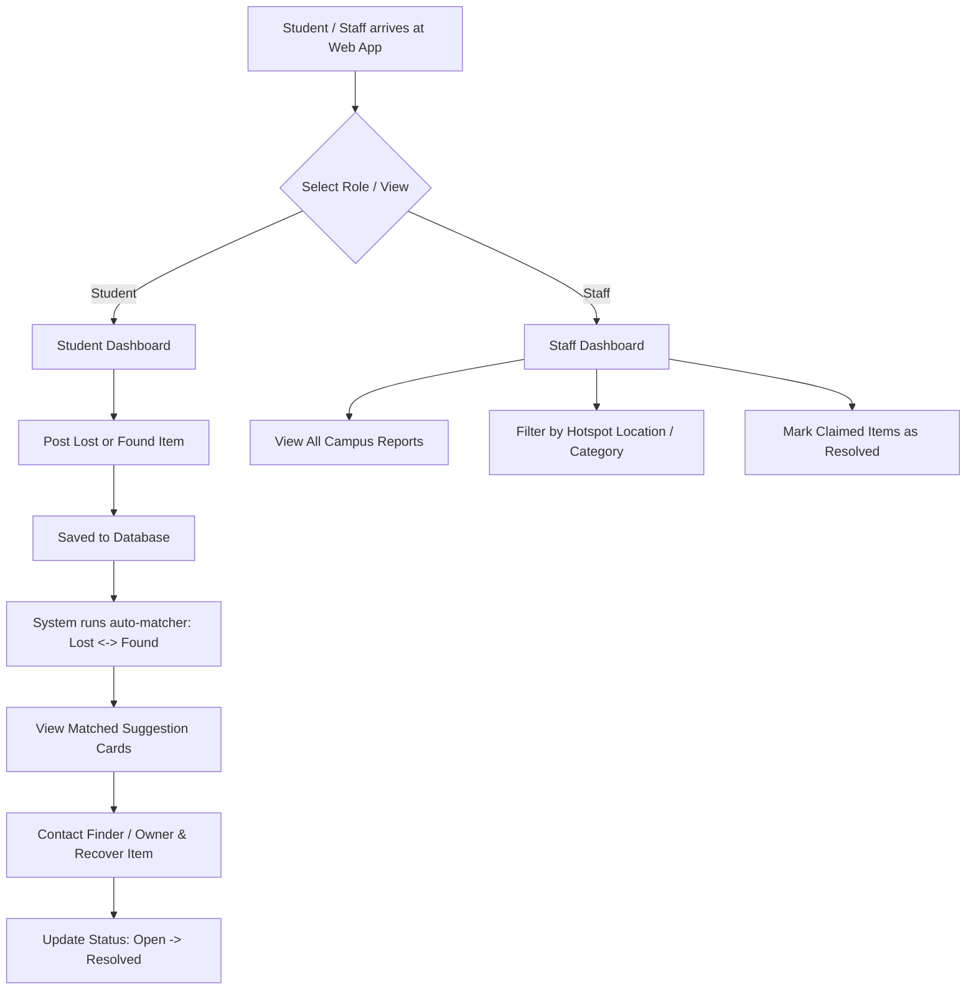

# 🏫 Campus Lost & Found Management System — Project Specification (PROJECT_SPEC.md)

---

## 1. 📌 Core Problem Statement
On college campuses, students frequently lose personal belongings (ID cards, lab manuals, keys, electronics, water bottles). Currently, reports are scattered across WhatsApp groups, physical notice boards, or lost item boxes without any centralized tracking. 

This project aims to build a centralized, fast, and structured **Campus Lost & Found Web Application** where students can post lost/found items, filter reports, view automated match suggestions, and mark items as resolved once recovered.

---

## 2. 👥 Target Users
1. **Students**:
   - Report lost items with details (Name, Category, Location, Date, Description).
   - Report found items to help fellow campus members.
   - Search/filter through reported items.
   - View automated match suggestions for their lost items.
   - Mark their posted items as `Open` or `Resolved`.
2. **Staff / Admin / Campus Security**:
   - Monitor total lost vs. found items on campus.
   - Verify and manage all reported items across campus locations.
   - Change item status (e.g., mark as `Resolved` when claimed at the security desk).

---

## 3. 🎯 MVP Features
- **Post Item (Lost / Found)**: Select type (`Lost` or `Found`), item name, category, campus location, date lost/found, contact details, and description.
- **Search & Filter**: Real-time filtering by status (`Open` / `Resolved`), item type (`Lost` / `Found`), category, location, and keyword search.
- **Automated Lost & Found Matcher**: Simple smart matching mechanism that compares a `Lost` item against existing `Found` items based on matching Category + Campus Location + Keyword similarity score.
- **Status Lifecycle**: Toggle item status between `Open` and `Resolved` with immediate DB persistence.
- **Analytics & Overview Metrics**: Counters for total open complaints, recovered items, and breakdown by category/location.
- **Database Persistence**: MongoDB backend persistence using Node.js & Express REST API.

---

## 4. 🖼️ Pages & Dashboards
1. **Student Dashboard (`/student`)**:
   - **Header Bar**: Quick stats & "Report New Item" action button.
   - **My Items Tab**: Displays items posted by the current student with `Open`/`Resolved` toggle controls.
   - **Lost & Found Feed Tab**: Search bar & filter pills (Category, Location, Type) to browse all campus items.
   - **Match Suggestions Drawer/Modal**: Displays potential `Found` item matches when viewing a `Lost` item.
2. **Staff Dashboard (`/staff`)**:
   - **Metrics Banner**: Real-time summary cards (Total Items, Total Resolved, High-Frequency Loss Locations).
   - **Global Audit Table**: Filterable table showing all reports with quick action buttons (Verify, Mark Resolved, Remove Spam).
   - **Location Analytics**: Quick view of top loss hotspots (e.g., Library, Canteen, Block B).

---

## 5. 🔄 Basic User Flow



---

## 6. 🛠️ Tech Stack

| Layer | Technology | Purpose |
| :--- | :--- | :--- |
| **Frontend Framework** | Vite + React 19 | Fast UI development & modern component architecture |
| **Styling** | Tailwind CSS v4 | Responsive layout & utility-first sleek styling |
| **Backend Runtime** | Node.js | Asynchronous JavaScript backend runtime |
| **Web Server** | Express.js | REST API routing & request handling |
| **Database** | MongoDB (Mongoose) | Document-based persistence for lost & found items |

---

## 7. 📁 MVP Architecture (Folder Structure)

```
p3/
├── PROJECT_SPEC.md
├── DESIGN.md
├── client/                     # Frontend (Vite + React 19 + Tailwind v4)
│   ├── public/
│   └── src/
│       ├── assets/
│       ├── components/         # Shared UI components
│       │   ├── Navbar.jsx
│       │   ├── Badge.jsx
│       │   ├── StatusToggle.jsx
│       │   └── SearchFilterBar.jsx
│       ├── pages/
│       │   ├── StudentDashboard.jsx    # Member 1 responsibility
│       │   └── StaffDashboard.jsx      # Member 2 responsibility
│       ├── services/
│       │   ├── api.js          # API client for backend communication
│       │   └── mockData.js     # Standalone mock fallback for independent dev
│       ├── App.jsx
│       ├── index.css
│       └── main.jsx
└── server/                     # Backend (Node.js + Express + MongoDB)
    ├── config/
    │   └── db.js               # MongoDB connection
    ├── controllers/
    │   └── itemController.js   # CRUD & Matcher logic (Member 3 responsibility)
    ├── models/
    │   └── Item.js             # Mongoose Item Schema (Member 3 responsibility)
    ├── routes/
    │   └── itemRoutes.js       # Express route handlers (Member 3 responsibility)
    ├── seed.js                 # Database seed script with sample data
    └── server.js               # Main Express entrypoint
```

---

## 8. 🎯 MVP Scope Boundary (6-Hour Feasibility)

### ✅ IN SCOPE (Must Have)
- Post item form with validation (Type, Name, Category, Location, Description, Contact info, Date).
- Full Search & Multi-filter (Keyword, Type, Category, Location, Status).
- Automated Matching logic (matching `Lost` items to `Found` items by category + location).
- Item status toggle (`Open` ↔ `Resolved`) with backend DB update.
- Student Dashboard & Staff Dashboard.
- MongoDB persistent data storage & Express REST backend.

### ❌ OUT OF SCOPE (Deferred / Avoid Over-Engineering)
- Real-time WebSockets / Chat system (simple phone/email contact is sufficient).
- Complex JWT authentication or OAuth single sign-on (simplified role switch/student ID input).
- Image upload cloud storage like AWS S3 (URL string or category default icons used for MVP).
- Complex AI image comparison algorithms (simple category/location keyword matcher used instead).

---

## 9. 👥 Team Task Allocation & Division of Labor

To ensure **independent development without blocking each other**, team duties are assigned as follows:

```
┌─────────────────────────────────────────────────────────────────────────────────┐
│                           TEAM TASK ALLOCATION                                  │
├───────────────────────────────┬───────────────────────────────┬─────────────────┤
│ MEMBER 1: Frontend Student    │ MEMBER 2: Frontend Staff      │ MEMBER 3: Full  │
│ Dashboard & Item Posting      │ Dashboard & Management        │ Backend & DB    │
└───────────────────────────────┴───────────────────────────────┴─────────────────┘
```

### 👨‍💻 Member 1: Frontend (Student Dashboard & Posting Flow)
- **Primary Focus**: Student-facing UI, Item Posting, Search/Filters, and Match Suggestion Cards.
- **Key Deliverables**:
  1. `StudentDashboard.jsx`: Main view displaying student's items and global feed.
  2. `PostItemModal.jsx`: Form modal to post a Lost or Found item.
  3. `MatchCard.jsx`: Card rendering recommended matching `Found` items for a `Lost` report.
  4. `SearchFilterBar.jsx`: Category pills, search input, and location dropdown filters.
- **Independent Strategy**: Uses `mockData.js` until Member 3 completes backend API endpoints.

### 👩‍💻 Member 2: Frontend (Staff Dashboard & Administration)
- **Primary Focus**: Staff/Admin UI, Overview Metrics, Global Moderation Table, and Quick Actions.
- **Key Deliverables**:
  1. `StaffDashboard.jsx`: Staff portal layout with analytics summary cards.
  2. `ItemTable.jsx`: Full campus item list with sorting, filtering, and bulk resolution.
  3. `AnalyticsSummary.jsx`: Metrics cards (Total Lost, Total Found, Resolution Rate %).
  4. `StatusToggle.jsx`: Quick status modifier button (`Open` -> `Resolved`).
- **Independent Strategy**: Uses `mockData.js` until Member 3 completes backend API endpoints.

### 🛠️ Member 3: Full Backend Engineer (Node.js + Express + MongoDB)
- **Primary Focus**: Server setup, Mongoose Schema, REST Controller logic, Matching algorithm, and DB persistence.
- **Key Deliverables**:
  1. `Item.js`: Mongoose model schema for items.
  2. `itemController.js`: CRUD methods (`getItems`, `createItem`, `updateStatus`, `getMatches`).
  3. Simple Matcher Algorithm: Finds items where `type` is opposite, `category` matches, and `location` contains similar keywords.
  4. `seed.js`: Database seeding script for quick 6-hour testing.
  5. `server.js` & CORS integration with Vite dev server.

---

## 10. 🔌 Integration Points & API Contracts

To allow Members 1 & 2 to build UIs independently of Member 3, the following API endpoints contract is strictly agreed upon:

### Data Model (`ItemSchema`)
```json
{
  "_id": "64f1a2b3c4d5e6f7a8b9c0d1",
  "title": "Black Leather Wallet",
  "type": "Lost",
  "category": "Electronics | Books | ID Cards | Bags | Accessories | Keys | Other",
  "location": "Library 2nd Floor",
  "description": "Contains student ID card and hostel room key.",
  "date": "2026-08-20",
  "contactInfo": "student@campus.edu / +91-9876543210",
  "status": "Open",
  "createdAt": "2026-08-21T10:00:00.000Z"
}
```

### Endpoints Table

| HTTP Method | Route | Description | Request Body / Query | Response |
| :--- | :--- | :--- | :--- | :--- |
| **GET** | `/api/items` | Fetch all items with filters | Query: `?type=Lost&category=Electronics&search=wallet&status=Open` | `{ success: true, count: N, data: [Item] }` |
| **POST** | `/api/items` | Post new Lost/Found item | `{ title, type, category, location, description, date, contactInfo }` | `{ success: true, data: Item }` |
| **PUT** | `/api/items/:id/status` | Update item status | `{ status: "Resolved" }` | `{ success: true, data: Item }` |
| **GET** | `/api/items/:id/matches` | Get potential matches for an item | None | `{ success: true, matches: [Item] }` |
| **GET** | `/api/items/stats` | Get metrics for Staff Dashboard | None | `{ success: true, stats: { total, lost, found, resolved } }` |

---

## 11. ⏱️ 6-Hour Timeline & Feasibility Plan

```
┌─────────────────────────────────────────────────────────────────────────────┐
│ HOUR 1: Alignment, API Contract Finalization & Project Boilerplate Setup    │
├─────────────────────────────────────────────────────────────────────────────┤
│ HOUR 2 - 3: Independent Parallel Development                                │
│   - Member 1: Build Student Dashboard & Item Post Modal (using mock API)    │
│   - Member 2: Build Staff Dashboard & Admin Table (using mock API)         │
│   - Member 3: Build Express Server, Mongoose Schemas & Controllers          │
├─────────────────────────────────────────────────────────────────────────────┤
│ HOUR 4: Matching Logic & Integration                                        │
│   - Member 3: Implement Matcher endpoint & test via Postman/Curl            │
│   - Member 1 & 2: Connect frontend services to real Express API endpoints   │
├─────────────────────────────────────────────────────────────────────────────┤
│ HOUR 5: Testing, Polishing UI & Edge Cases                                  │
│   - End-to-end post -> match -> resolve testing                             │
│   - Styling refinement based on DESIGN.md                                   │
├─────────────────────────────────────────────────────────────────────────────┤
│ HOUR 6: Demo Preparation & Final Bug Fixes                                  │
└─────────────────────────────────────────────────────────────────────────────┘
```

> [!TIP]
> **Key to 6-Hour Success**: Strict adherence to mock API contracts enables all three developers to code non-stop without waiting on each other's code to be finished.
